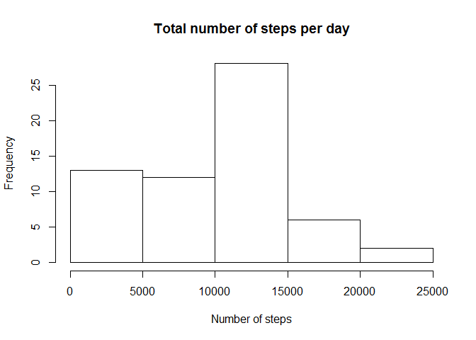
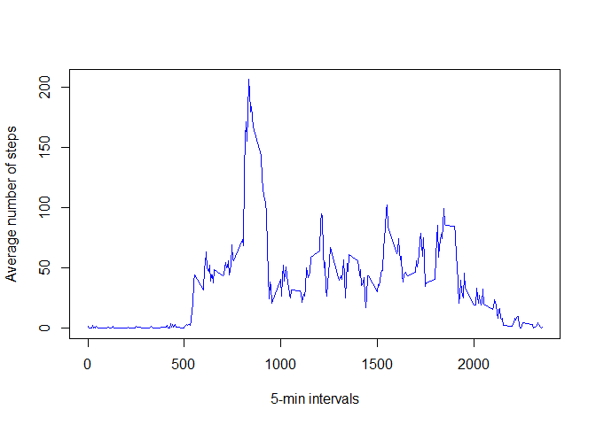
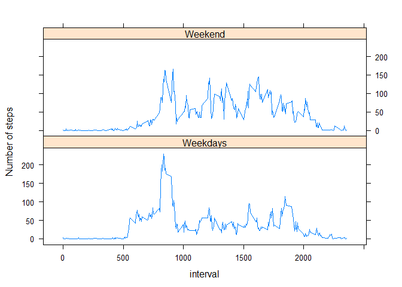

# Reproducible Research: Peer Assessment 1


## Loading and preprocessing the data

First let's read the data (It is assumed that the data files "activity.csv" is in the working directory)

```r
activity<-read.csv("activity.csv",header=TRUE,stringsAsFactor=FALSE)
```

Next steps is to convert the date column into POSIX date format for future processing

```r
activity$date<-as.POSIXct(activity$date)
```

## What is mean total number of steps taken per day?

For this analysis we will use the ***dplyr*** package. We compute the total steps per day with dplyr package

```r
# Load dplyr library
library(dplyr)
```

```r
# Group by date and compute total
activity.g<-group_by(activity,factor(date))
tot.steps<-summarize(activity.g, sum(steps,na.rm=TRUE))
names(tot.steps)<-c("date","tot.steps")
head(tot.steps)
```

```
## Source: local data frame [6 x 2]
## 
##         date tot.steps
## 1 2012-10-01         0
## 2 2012-10-02       126
## 3 2012-10-03     11352
## 4 2012-10-04     12116
## 5 2012-10-05     13294
## 6 2012-10-06     15420
```
Histogram of total number of steps per day

```r
hist(tot.steps$tot.steps,xlab="Number of steps",main="Total number of steps per day")
```

 

Mean of total number of step taken per day

```r
mean(tot.steps$tot.steps,na.rm=TRUE)
```

```
## [1] 9354.23
```

Median of total number of steps taken per day

```r
median(tot.steps$tot.steps,na.rm=TRUE)
```

```
## [1] 10395
```

## What is the average daily activity pattern?
Using dplyr we group by intervals then compute the average per interval across all date

```r
activity.g<-group_by(activity,factor(interval))
aver.steps<-summarize(activity.g,mean(steps,na.rm=TRUE))
names(aver.steps)<-c("interval","aver.steps")
```

We can now plot the time series of average steps per interval


```r
plot(as.vector(aver.steps$interval),aver.steps$aver.steps,xlab="5-min intervals",
     ylab="Average number of steps",type="l",col="blue")
```

 

To extract the 5-min interval with the maximum number of steps we use the following code

```r
# Get the indice of the maximum number of steps
ind.max<-which.max(aver.steps$aver.steps)
# Extract the 5-min interval with the maximum number of steps
int.max<-as.vector(aver.steps$interval)[ind.max]
# Print to screen
print(as.numeric(int.max))
```

```
## [1] 835
```

## Imputing missing values
We will first calculate and report the total number of NA (rows with NAs)

```r
# Extract indices of row with NA values
ind.na<-which(is.na(activity$steps)==TRUE)

# count how many indices there is
nb.na<-length(ind.na)

# Print the number of rows with NA
print(nb.na)
```

```
## [1] 2304
```
The NA will be replaced by the average number of steps per 5-min interval. First we will extract the NA rows and the rows without NA in two seperate dataframes

```r
# extract all the rows with NA in a new data.frame
activ.na<-activity[ind.na,]

# Extract all the rows without NA in a new data.frame
activ<-activity[-ind.na,]
```
Next we will merge the previously computed average number of steps per 5-min interval with the NA dataframe using the "interval" columns as a common data field


```r
merged.na<-merge(activ.na,aver.steps,by.x="interval",by.y="interval")

# Rearrange the merged result to prepare it to be appended to the dataframe without NA
merged.na<-merged.na[,c(4,3,1)]

# Rename the first column
names(merged.na)[1]<-"steps"

# Merge dataframes to create the new dataframe with imputted NAs
activity.new<-rbind(activ,merged.na)
head(activity.new)
```

```
##     steps       date interval
## 289     0 2012-10-02        0
## 290     0 2012-10-02        5
## 291     0 2012-10-02       10
## 292     0 2012-10-02       15
## 293     0 2012-10-02       20
## 294     0 2012-10-02       25
```

We recompute the total number of steps per day using the new dataframe with the imputed missing data:

```r
# Group by date and compute total
activity.g<-group_by(activity.new,factor(date))
tot.steps<-summarize(activity.g, sum(steps,na.rm=TRUE))
names(tot.steps)<-c("date","tot.steps")
head(tot.steps)
```

```
## Source: local data frame [6 x 2]
## 
##         date tot.steps
## 1 2012-10-01  10766.19
## 2 2012-10-02    126.00
## 3 2012-10-03  11352.00
## 4 2012-10-04  12116.00
## 5 2012-10-05  13294.00
## 6 2012-10-06  15420.00
```
Histogram of total number of steps per day after missing values imputting

```r
hist(tot.steps$tot.steps,xlab="Number of steps",main="Total number of steps per day")
```

 

Mean of total number of step taken per day after missing values imputting

```r
mean(tot.steps$tot.steps,na.rm=TRUE)
```

```
## [1] 10766.19
```

Median of total number of steps taken per day after missing values imputting

```r
median(tot.steps$tot.steps,na.rm=TRUE)
```

```
## [1] 10766.19
```
The new histogram is less skewed (closer to a normal distribution) as evidenced by the mean and the median being equal. Also the mean is higher (9350 before missing values imputting vs 1076 afterwards).

## Are there differences in activity patterns between weekdays and weekends?
We will first convert dates to days and create a code for weekdays and weekends.

```r
# Converting dates to days
date.days<-weekdays(activity.new$date)

# Creating indices for weekend
ind.wknd<-which(date.days=="Saturday" | date.days=="Sunday")

# Adding new factor
activity.new$fact.d<-"Weekdays"
activity.new$fact.d[ind.wknd]<-"Weekend"
activity.new$fact.d<-as.factor(activity.new$fact.d)
```

Using the ***dplyr*** package again we group by intervals and the new weekdays or weekend factor and compute the average across all date

```r
activity.g<-group_by(activity.new,factor(interval),fact.d)
aver.steps<-summarize(activity.g,mean(steps,na.rm=TRUE))
names(aver.steps)<-c("interval","fact.d","aver.steps")
aver.steps$interval<-as.numeric(as.vector(aver.steps$interval))
```

The results are plotted below using the ***lattice*** package 

```r
library(lattice)
xyplot(aver.steps~interval | fact.d,data=aver.steps,labels=c("4","5"),type="l",
       layout=c(1,2),ylab="Number of steps")
```

 
